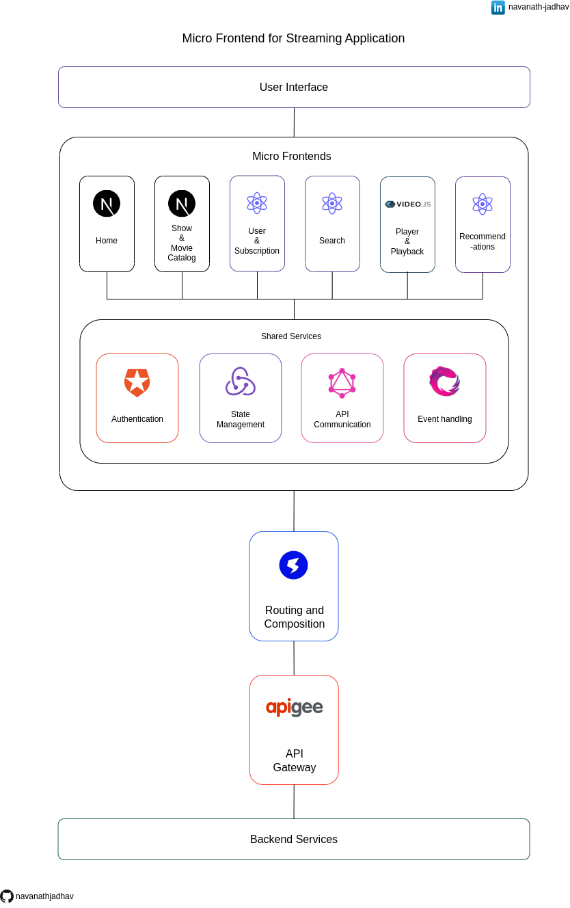

# Micro Frontend for Streaming Application

Welcome to the Micro Frontend architecture for a streaming application. This repository presents the design for a modular and scalable streaming platform, employing the Micro Frontend approach. This architecture aims to enhance flexibility, scalability, and user experience by dividing the application into distinct and independent Micro Frontends.

## Give a Star ⭐

If you liked this project or found it helpful then please give it a star.
Thanks.

## Architecture diagram

## Download

Get a [PDF version](./Micro_Frontend_for_Streaming_Application.pdf).

## User Interface

The User Interface (UI) layer is responsible for presenting the application's visual components to users and handling their interactions. It ensures a smooth and intuitive experience by providing an appealing and responsive interface.

## Micro Frontends

The application is composed of several Micro Frontends, each responsible for a specific functionality or feature. The Micro Frontends included in this architecture are:

### Home using Next.js

The Home Micro Frontend, built with Next.js, serves as the landing page for users. It showcases featured shows, movies, and trending content to captivate users' attention.

### Show & Movie Catalog using Next.js

This Micro Frontend, powered by Next.js, focuses on presenting the extensive catalog of shows and movies available for streaming. It provides users with the ability to explore genres, view details, and select content for playback.

### User & Subscription using React

The User & Subscription Micro Frontend, developed in React, manages user profiles, preferences, and subscription details. It ensures that users have a personalized and tailored experience.

### Search using React

The Search Micro Frontend, created with React, empowers users to easily search for their preferred shows and movies. It offers a seamless and efficient search experience.

### Player & Playback using Video.js

The Player & Playback Micro Frontend utilizes Video.js to handle the actual playback of selected content. It provides essential playback controls and ensures smooth and high-quality streaming.

### Recommendations using React

The Recommendations Micro Frontend, also built with React, utilizes user preferences and viewing history to offer personalized content recommendations. It enhances the user experience by suggesting relevant shows and movies.

### Shared Services

#### Authentication using Auth0

The Authentication Shared Service employs Auth0, a popular identity and access management platform, to handle user authentication and authorization. It provides secure user authentication, manages user sessions, and ensures that only authorized users can access protected resources.

#### State management using Redux

The State Management Shared Service utilizes Redux, a predictable state container for JavaScript applications. It provides a centralized state management solution, allowing different Micro Frontends to access and update shared application state efficiently.

#### API communication using GraphQL

The API Communication Shared Service leverages GraphQL, a query language for APIs, to facilitate efficient and flexible communication between the Micro Frontends and the backend services. GraphQL enables clients to request specific data and reduces over-fetching or under-fetching of data.

#### Event Handling using RXJS

The Event Handling Shared Service uses RXJS, a reactive programming library, to manage and handle asynchronous events within the Micro Frontend architecture. It enables efficient event-driven communication and provides tools for managing complex event streams.

## Routing and Composition using single-spa

The Routing and Composition layer is implemented using single-spa, a JavaScript framework for building Micro Frontend applications. It handles the routing and composition of the different Micro Frontends, allowing them to coexist within the same application and seamlessly navigate between them. single-spa ensures that the appropriate Micro Frontend is loaded based on the user's actions, providing a cohesive user experience.

## API Gateway using apigee

The API Gateway, implemented using apigee, serves as a centralized entry point for client requests. It acts as a mediator between the client and the Micro Frontends, handling tasks such as request routing, security, protocol translation, and caching. The API Gateway simplifies client-side integration by providing a unified API interface and enhancing the overall performance, scalability, and security of the system.

## Backend Services

Backend Services are the backbone that empowers the Micro Frontends. These services are responsible for diverse tasks including data storage, intricate business logic, and seamless integration with external systems. In the realm of the streaming architecture, these Backend Services undertake pivotal roles such as content management, user preferences, playback history, and real-time recommendations. They furnish the essential functionality and data essential for the Micro Frontends to orchestrate a comprehensive and immersive streaming experience.

## Conclusion

The Micro Frontend architecture for the streaming application ensures a modular, scalable, and interactive streaming experience. By leveraging independent Micro Frontends like Player & Playback and utilizing shared services like Authentication, State Management, API Communication, and Event Handling, this architecture fosters streamlined development and maintenance. The implementation of Video.js in the Player & Playback Micro Frontend, combined with the use of shared services, results in an engaging and user-centric streaming platform.

## Share & Care

If you think this project is helpful share it on [Twitter](https://twitter.com/intent/tweet?url=https://github.com/navanathjadhav/Micro-Frontend-for-Streaming-Application).

## Contribute

You are always welcome to help to make this project more knowledgeable and helpful for other developers.

Submit a PR.
